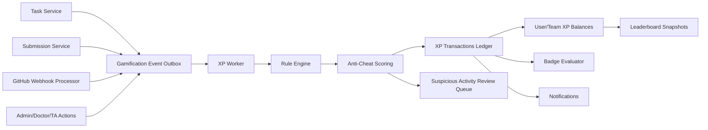

# Gamification Feature Planning Document

## 0. Purpose, Scope, and Current State

This document defines the recommended product logic and technical architecture for the GPMS gamification feature. It is intended for product managers, backend developers, frontend developers, doctors, teaching assistants, admins, and project stakeholders.

The goal is to encourage steady, high-quality graduation project work without turning academic evaluation into a shallow activity counter. The system should reward verified progress, useful collaboration, quality, and consistency. It should avoid rewarding spam, fake GitHub activity, superficial task completion, or unequal team behavior.

Current implementation snapshot from the repository:

- Frontend has a gamification hub at `app/dashboard/gamification/page.tsx`.
- Frontend has preview components for XP, achievements, and leaderboards in `components/dashboard/gamification-tab.tsx` and `components/gamification/*`.
- Frontend mock `User` type contains `xp`, `gold`, `level`, and `streak`.
- Backend Prisma schema currently does not persist XP, badges, leaderboards, quests, or gamification transactions.
- Backend already has useful source events: `Task`, `Submission`, `WeeklyReport`, `Team`, `GitHubTeamRepository`, `GitHubWebhookDelivery`, grades, task reviews, GitHub issues, branches, commits, pull requests, releases, notifications, and roles.
- GitHub integration already supports repository connection, commits, issues, PRs, reviews, merges, releases, contributors, webhooks, and task-linked GitHub workflows.

Recommended core decision:

- Build gamification as a ledger-based, event-driven backend module.
- Keep permanent lifetime XP, but rank students mostly by time-bounded season/weekly XP.
- Count GitHub contributions only when tied to meaningful project work and validated by rules or review.
- Separate individual XP from team XP.
- Make every XP change explainable, auditable, reversible, and visible to the affected user.

## 1. XP and Points System

### 1.1 Key Concepts

Use separate concepts for separate purposes:

| Concept | Purpose | Persistent | Spendable | Recommended Use |
| --- | --- | --- | --- | --- |
| XP | Measures verified learning/progress | Yes | No | Levels, profile progress, lifetime achievement |
| Season XP | Time-bounded XP derived from transactions | Recomputed | No | Weekly/monthly/semester leaderboards |
| Team XP | Measures team progress and health | Yes | No | Team leaderboards, team milestones |
| Coins | Optional reward currency | Yes | Yes | Cosmetic rewards only, never academic advantage |
| Badges | Achievement markers | Yes | No | Profiles, motivation, milestone recognition |
| Quality score | Quality signal from grades/reviews | Yes | No | Tie-breakers, badges, anti-cheat signals |

XP should never replace grades. XP is a motivational layer. Grades remain academic evaluation.

### 1.2 Overall Points Distribution Model

Recommended semester-level distribution:

| Category | Target Share | Rationale |
| --- | ---: | --- |
| Approved tasks | 30% | Rewards ongoing execution, not only final milestones |
| Approved deliverables and SDLC milestones | 30% | Keeps focus on graduation project outcomes |
| GitHub contributions | 15% | Rewards technical evidence, but caps volume gaming |
| Collaboration and reviews | 10% | Encourages teamwork and code/design feedback |
| Consistency and participation | 5% | Helps students build rhythm without overvaluing logins |
| Badges/challenges/bonus events | 5% | Adds motivation without distorting behavior |
| Manual academic recognition | 5% | Allows doctors/admins to recognize exceptional work |

Keep these as configurable weights in `GamificationRule`, not hard-coded constants.

### 1.3 Fixed, Dynamic, or Weighted XP

Use a hybrid model:

- Fixed base XP by activity type.
- Weighted by difficulty, priority, task type, quality, timeliness, and evidence.
- Capped by source to prevent farming.

Recommended formula:

```text
finalXP =
  round(baseXP
    * difficultyMultiplier
    * qualityMultiplier
    * timelinessMultiplier
    * evidenceMultiplier
    * roleOrContributionShare)
```

Recommended multipliers:

| Factor | Values |
| --- | --- |
| Difficulty | EASY `0.75`, MEDIUM `1.0`, HARD `1.35`, CRITICAL `1.6` |
| Priority fallback | LOW `0.8`, MEDIUM `1.0`, HIGH `1.25`, CRITICAL `1.5` |
| Quality | Needs revision `0`, acceptable `0.75`, good `1.0`, excellent `1.2` |
| Timeliness | Early/on-time `1.0`, late tiered from `0.8` to `0` |
| Evidence | Weak `0.5`, normal `1.0`, strong `1.15` |

For the MVP, if no explicit difficulty exists, map `TaskPriority` to the difficulty multiplier.

### 1.4 Task XP Values

Award XP only when a task is approved or completed through the formal workflow. Do not award meaningful XP for simply creating, accepting, or moving a task.

| Task Type | Base XP | Notes |
| --- | ---: | --- |
| CODE | 80 | Requires linked PR, commits, or reviewer approval for GitHub-backed tasks |
| DOCUMENTATION | 60 | Requires meaningful document update or reviewed deliverable |
| DESIGN | 70 | Includes diagrams, architecture, UX flows, database design |
| RESEARCH | 50 | Requires source-backed notes, summary, or accepted findings |
| MEETING | 20 | Only for approved minutes/action items, not attendance alone |
| PRESENTATION | 60 | For rehearsed, reviewed, or submitted presentation work |
| TESTING/QA | 70 | Use `OTHER` now or add a future enum; reward test plans and bug verification |
| BUG FIX | 70 | Use `CODE` plus bug label now, or add a future task type |
| OTHER | 30 | Default low-confidence category |

Recommended workflow rewards:

| Event | XP | Rule |
| --- | ---: | --- |
| Task accepted | 0 | Avoid rewarding claiming work |
| Task submitted for review | 0 to 5 | Optional tiny progress signal, not leaderboard XP |
| Task approved | Base XP formula | Main task reward |
| Task sent back for revision | 0 | No penalty unless abuse is confirmed |
| Revised task approved | 70% to 100% of computed XP | Depends on final quality and number of revisions |
| Task reopened after approval | Freeze transaction pending review | Reverse if approval was invalid |
| Deleted/cancelled task | No XP, or reverse existing XP | Use ledger reversal |

### 1.5 Deliverable and Milestone XP

Deliverables should mostly reward the team, with small individual credit for the submitter and documented contributors.

| Deliverable | Team XP | Submitter XP | Contributor Pool | Quality Gate |
| --- | ---: | ---: | ---: | --- |
| SRS | 300 | 30 | 120 | Approved by doctor/TA |
| UML/design package | 250 | 25 | 100 | Approved by doctor/TA |
| Prototype | 300 | 30 | 120 | Approved demo or artifact |
| Code release | 500 | 40 | 250 | GitHub release/merged milestone plus approval |
| Test plan | 300 | 30 | 120 | Approved test evidence |
| Final report | 450 | 40 | 180 | Approved by doctor/TA |
| Presentation | 300 | 30 | 120 | Approved final presentation material |

Contributor pool allocation:

- Default: equal split among documented contributors.
- Better: use linked tasks, GitHub PR authors/reviewers, document uploaders, and doctor/TA adjustments.
- Require supervisor confirmation for large unequal allocations.

### 1.6 High, Medium, and Low XP Activities

High XP activities:

- Approved major deliverables.
- Approved critical/high-priority tasks.
- Merged PRs linked to GPMS tasks with meaningful code or tests.
- Final releases and project milestone completion.
- Excellent doctor/TA evaluation of a project phase.
- High-quality code review that prevents bugs or improves architecture.
- Fixing verified critical bugs.

Medium XP activities:

- Approved normal tasks.
- Meaningful documentation updates.
- Reviewed design diagrams.
- Creating and closing task-linked GitHub issues.
- Reviewing PRs with specific, actionable feedback.
- Approved weekly reports.
- Attending and contributing to required milestone meetings when documented.

Low XP activities:

- Profile completion.
- First successful GitHub connection.
- Helpful comments in team discussions.
- Short streak milestones.
- Submitting meeting minutes.
- Small bug fixes.
- Creating useful tasks that are later accepted by the team leader or supervisor.

No XP activities:

- Login alone.
- Page views.
- Clicking buttons or changing UI preferences.
- Creating tasks and assigning them to yourself without approval.
- Raw number of commits without reviewed work.
- Duplicate issues, duplicate PRs, or reopened spam.
- Meaningless comments such as "good", "done", "please check".
- Generated/vendor/lockfile-only changes unless the task explicitly requires them.
- Deleted work or work reverted because it was incorrect.
- Actions performed while the user account, team, or source event is under fraud review.

### 1.7 XP Decay

Permanent lifetime XP should not decay. Students should keep credit for verified work.

Use separate time-bounded scores instead:

- Weekly XP for short-term motivation.
- Monthly XP for medium-term competition.
- Semester XP for course/module ranking.
- Lifetime XP for profile level.

This avoids punishing students for old achievements while keeping leaderboards fresh.

### 1.8 Late Submissions

Late submissions should receive reduced XP, unless a doctor/admin marks an approved exception.

Recommended timeliness multiplier:

| Delay | XP Multiplier |
| --- | ---: |
| On time or early | 1.0 |
| Less than 24 hours late | 0.8 |
| 1 to 3 days late | 0.6 |
| 3 to 7 days late | 0.4 |
| More than 7 days late | 0 by default, manual review required |

Late work should still be graded academically according to course policy. XP reduction is a gamification consequence, not a grade rule.

### 1.9 Repeated or Low-Quality Submissions

Repeated attempts should not farm XP.

Recommended rules:

- First approved submission earns normal XP.
- Revision-required attempts earn no XP.
- Final approved revision earns XP based on final quality and timeliness.
- If a deliverable has multiple versions, only the latest approved version earns deliverable XP.
- If the same source is resubmitted with minor changes, cap XP at 20% unless the reviewer confirms meaningful improvement.
- Poor quality should reduce the initial XP multiplier, not subtract previously earned unrelated XP.

### 1.10 Grades and XP

Grades should influence XP at the moment of approval, but should not act as direct ongoing XP mutations.

Recommended grade multiplier:

| Grade / Evaluation | XP Multiplier | Additional Effect |
| --- | ---: | --- |
| 90-100 | 1.2 | Eligible for excellence badge |
| 80-89 | 1.0 | Normal XP |
| 70-79 | 0.8 | Normal completion, lower quality reward |
| 60-69 | 0.5 | Warning signal if repeated |
| Below 60 / revision required | 0 | No XP until approved |

Do not reduce unrelated historical XP for poor grades. If fraud is confirmed, rollback the fraudulent transaction.

### 1.11 GitHub Contributions

GitHub contributions should count toward XP, but only as validated evidence of meaningful project work.

Recommended decision:

- Count GitHub XP for repositories connected to GPMS teams.
- Require the GitHub account to be linked to a GPMS user.
- Prefer task-linked branches, issues, and PRs.
- Use a hybrid automatic/manual model.
- Cap GitHub XP so it cannot dominate academic progress.

Rewardable GitHub actions:

| GitHub Action | XP | Automation Level | Conditions |
| --- | ---: | --- | --- |
| Commit to linked task branch | 2 to 5 each, cap 20 per task | Automatic with checks | Meaningful diff, linked user, not generated-only |
| PR opened for GPMS task | 10 | Automatic | Linked task, non-empty diff |
| PR merged for GPMS task | 40 to 120 | Automatic plus review signals | Merged into accepted branch, linked task, meaningful diff |
| PR review | 20 to 40 | Automatic with quality checks | Non-author review, actionable comments or approval/request changes |
| Issue created | 5 to 15 | Hybrid | Later linked to task, accepted by leader/supervisor |
| Issue closed by linked PR | 15 to 30 | Automatic | Closed through PR or supervisor-confirmed resolution |
| Meaningful comment | 5 to 15 | Automatic with strict caps | Minimum length, specific, non-repeated, relevant to issue/PR |
| Release created | 50 to 150 team XP | Hybrid | Maps to submission/milestone, approved by supervisor |
| CI/test improvement | 20 to 60 | Hybrid | Adds or fixes tests, verified by diff or review |

Do not reward raw commit count as a primary metric. Commits are evidence, not the main product outcome.

Prevent fake or low-quality GitHub activity:

- Require linked GPMS task, issue, or milestone for full XP.
- Ignore commits that only change whitespace, generated files, vendor files, build output, or lockfiles unless explicitly relevant.
- Ignore merge commits for individual commit XP.
- Cap XP per task, per PR, per day, and per user.
- Require minimum diff substance, such as changed source/test/docs lines above configured thresholds.
- Reward merged PRs more than opened PRs.
- Reward reviewed PRs more than self-merged PRs.
- Detect burst activity, repeated tiny commits, repeated comments, and self-review patterns.
- Compare commit author email/login to linked `GitHubUserConnection`.
- Store GitHub event payload hashes and use idempotency keys.
- Use doctor/TA/admin review for suspicious or high-value GitHub XP.

Recommended GitHub XP mode:

- Automatic for low-risk, low-value events after validation.
- Manual approval for high-value awards, releases, milestone PRs, suspicious activity, or disputed attribution.
- Hybrid review queue where suspicious XP is frozen until accepted.

### 1.12 Level Curve

Levels should feel reachable early and slower later.

Recommended MVP formula:

```text
xpRequiredForNextLevel = 150 + (currentLevel * 50)
```

Recommended long-term formula:

```text
totalXpForLevel(level) = round(100 * level^1.65)
```

Levels are cosmetic and motivational. They should not unlock academic privileges.

## 2. XP Control and Administration

### 2.1 Role Permissions

| Role | Recommended XP Permission |
| --- | --- |
| Student/member | View own XP, transactions, badges, team score, and leaderboard context |
| Leader | View team gamification details; cannot directly grant XP |
| TA | Can recommend XP adjustments for assigned teams; can approve low-risk task/deliverable XP if delegated |
| Doctor | Can approve, adjust, freeze, or reject XP for assigned teams within course policy |
| Admin | Full XP administration, rule configuration, reversals, audit access |

Doctors should be able to control XP for their supervised teams, but within logged and configurable policies.

TAs should have limited control. Recommended policy:

- TAs can approve standard task/deliverable XP if they are assigned to the team.
- TAs can propose manual bonus/penalty adjustments.
- Large adjustments or negative adjustments require doctor/admin approval.

Admins can manually increase or decrease XP, but every action must be logged.

### 2.2 Manual XP Adjustments

Manual adjustment types:

- Bonus: exceptional contribution, competition award, presentation excellence.
- Correction: fix incorrect automatic calculation.
- Penalty: confirmed abuse or policy violation.
- Rollback: reverse a specific XP transaction.
- Freeze: hold suspicious pending XP.

Approval requirements:

| Adjustment | Approval |
| --- | --- |
| Positive adjustment up to 50 XP | TA or doctor for assigned team |
| Positive adjustment 51-200 XP | Doctor or admin |
| Positive adjustment above 200 XP | Admin or doctor plus admin policy |
| Negative adjustment | Doctor/admin approval required |
| Fraud rollback | Admin or doctor after review |
| Rule changes | Admin only |

### 2.3 Audit and Transparency

All XP changes must be logged.

Each XP transaction should show:

- Amount.
- Recipient.
- Source activity.
- Reason.
- Rule version.
- Actor or system worker that created it.
- Status: pending, awarded, frozen, reversed, rejected.
- Review metadata when applicable.

Students should be able to see why XP changed:

- "Task approved: Implement login API, +100 XP."
- "Late submission multiplier: 0.8."
- "GitHub PR merged and linked to task, +60 XP."
- "XP frozen pending review: duplicate submission signal."
- "XP reversed by admin: duplicate PR, -40 XP."

### 2.4 Grades and Evaluations as XP Signals

Grades should affect the quality multiplier for the source event. They should not continuously increase/decrease existing XP after the fact unless the grade was corrected.

Poor evaluations should:

- Reduce or block XP for that source event.
- Trigger warnings after repeated poor outcomes.
- Freeze suspicious progress only if paired with anti-cheat or abuse signals.
- Not reduce unrelated historical XP.

## 3. Individual vs Team-Based Points

### 3.1 Recommended Model

Use both individual XP and team XP, stored separately.

Individual XP rewards:

- Approved assigned tasks.
- Meaningful GitHub contributions.
- Reviews and collaboration.
- Badges.
- Personal consistency.

Team XP rewards:

- Approved deliverables.
- SDLC phase completion.
- Team-wide weekly reports.
- Releases.
- Team challenge completion.
- Healthy collaboration signals.

Do not simply split all team XP equally among all members. Equal splits hide free-riding and can demotivate high contributors.

### 3.2 Team XP and Individual XP Separation

Recommended transaction target types:

- `USER`: XP belongs to one user.
- `TEAM`: XP belongs to the team.
- `USER_AND_TEAM`: one source creates separate user and team transactions.

Example:

- A code task approval awards 110 individual XP to the assignee.
- A milestone code release awards 500 team XP.
- The release also creates a contributor pool split among verified contributors.

### 3.3 Contribution Inside Teams

One member's contribution should not automatically grant equal individual XP to everyone.

Recommended approach:

- Team deliverables grant team XP.
- Individual contributor XP is allocated from evidence:
  - Assigned tasks.
  - Merged PRs.
  - Document uploads.
  - Review history.
  - Meeting action items.
  - Doctor/TA evaluation.
  - Peer evaluation, if implemented later.

A strong member can help the team score by completing important work, but should not completely hide a weak member's individual inactivity.

### 3.4 Can Teams Lose Points?

Avoid subtracting permanent team XP because one member is inactive. This creates resentment and unfair collective punishment.

Use softer mechanisms:

- Team health warnings.
- Team leaderboard health multiplier for current week/month only.
- Supervisor alerts.
- Free-rider review queue.
- Reduced contributor share for inactive members.

Only apply team penalties after warnings and review.

### 3.5 Leaderboards

Use both:

- Individual leaderboards.
- Team leaderboards.
- Optional improvement leaderboard for students who start lower but improve steadily.

This keeps the system fair for both solo contribution and team outcomes.

## 4. Team Impact Rules

### 4.1 Team Score Formula

Recommended team score for leaderboards:

```text
teamLeaderboardScore =
  (milestoneXp * 0.60)
  + (normalizedMemberContribution * 0.25)
  + (collaborationHealthScore * 0.15)
```

Where:

```text
normalizedMemberContribution =
  average(activeMemberSeasonXp)
```

Use average instead of total to avoid giving larger teams an automatic advantage.

Alternative for stricter courses:

```text
normalizedMemberContribution =
  0.70 * average(memberXp)
  + 0.30 * median(memberXp)
```

The median component prevents one very strong member from fully compensating for a completely inactive team.

### 4.2 Inactivity Detection

Flag a member as inactive for a week if they have none of:

- Approved task progress.
- Meaningful GitHub contribution.
- Documented meeting action item.
- Approved review/comment.
- Supervisor-recognized contribution.

Recommended thresholds:

- Week 1 inactive: private warning to student and team leader.
- Week 2 inactive: notify TA/doctor and mark team health at risk.
- Week 3 inactive: freeze the inactive member's bonus/team-share XP until review.
- Repeated inactivity: supervisor intervention, possible team restructuring.

### 4.3 Team Penalties

Team penalties should be rare and reviewed.

Recommended policy:

- Do not penalize team XP for one inactive member if the team still meets milestones.
- Apply a temporary team leaderboard health multiplier only after warnings.
- Active members can protect the team by documenting contribution and requesting supervisor review.
- Confirmed free-riding should reduce or remove the free-rider's individual contributor share, not erase everyone else's XP.

### 4.4 Edge Cases

| Case | Recommended Handling |
| --- | --- |
| Student changes team | Individual XP follows the student; historical team XP stays with original team |
| Team member leaves mid-semester | Count contribution only during membership window |
| Task reassigned | XP goes to final approved assignee; partial credit requires reviewer/manual adjustment |
| Shared task | Allow multiple contributors with explicit shares or linked subtasks |
| Doctor changes grade | Recompute/reverse affected XP transaction using ledger correction |
| GitHub username linked after work | Store pending attribution, award only after verified link |
| Team deleted | Preserve audit and historical transactions; hide from active leaderboards |

## 5. Leaderboard Design

### 5.1 Ranking Basis

Do not use one global leaderboard as the only view.

Recommended leaderboards:

| Leaderboard | Ranking Basis | Reset |
| --- | --- | --- |
| Individual weekly | Weekly earned XP | Weekly |
| Individual semester | Semester XP | Semester/course |
| Individual lifetime | Lifetime XP | Never |
| Team weekly | Team leaderboard score | Weekly |
| Team semester | Team score across current course/module | Semester/course |
| GitHub quality | Merged task-linked PRs, reviews, quality score | Monthly |
| Improvement | Percentage improvement from previous period | Monthly |
| Badge collectors | Earned badges by category | Semester |

Ranking inputs:

- Total XP: good for lifetime profile.
- Weekly XP: best for active motivation.
- Monthly XP: good for challenges.
- Team XP: best for project outcomes.
- Task completion rate: tie-breaker, not primary score.
- Quality score: tie-breaker and badge input.
- GitHub activity: separate or weighted input, capped.
- Grades/evaluations: quality multiplier and tie-breaker, not raw leaderboard points.

### 5.2 Grouping

Leaderboards should be scoped by:

- Course/module.
- Batch/year.
- Track/specialization.
- Team.
- Supervisor group.
- Level/tier.

Never rank first-year style beginners against advanced students if the context is unfair. For graduation projects, the default should be batch/course scoped.

### 5.3 Visibility

Recommended UI:

- Show top 10 or top 20.
- Always show the current user's row with nearby ranks.
- Allow filters for weekly, monthly, semester, team, track.
- Show score breakdown, not only rank.
- Show badges and improvement streaks.

Avoid showing a full list of all low-ranked students by default. It can discourage students and create public shame.

### 5.4 Tie-Breakers

Use deterministic tie-breakers:

1. Higher quality score.
2. More approved high/critical tasks.
3. More team milestone contribution.
4. Fewer frozen/suspicious events.
5. Earlier time reaching score.

### 5.5 Preventing Discouragement

Use:

- Personal progress cards.
- "Nearby students" view instead of only top rank.
- Improvement leaderboard.
- Level tiers or leagues.
- Team goals.
- Private coach-style recommendations.
- Badges for consistency and improvement, not only top performers.

## 6. Badges and Achievements

### 6.1 Current Badges in the Frontend

Current badges are frontend/mock only. There is no backend persistence for badge definitions or user badge unlocks yet.

Badges currently shown in dashboard preview:

- First Steps.
- Team Player.
- Code Warrior.
- Perfect Score.
- Streak Master.

Badges currently defined in the full gamification page:

- Welcome Aboard.
- First Steps.
- Identity Established.
- Task Apprentice.
- Task Expert.
- Task Master.
- Task Legend.
- Code Beginner.
- Code Warrior.
- Code Reviewer.
- Bug Hunter.
- Team Player.
- Discussion Starter.
- Mentor.
- Getting Started.
- Week Warrior.
- Month Master.
- Streak Legend.
- Early Bird.
- Night Owl.
- Perfect Week.
- Speedster.
- Team Founder.
- Team Builder.
- Project Champion.

Reward store badge-like items currently shown:

- Pro Developer Badge.
- Top Contributor Badge.
- Legend Badge.

### 6.2 Recommended Badge Model

Badges should mostly act as achievements. They may grant small one-time XP, but they should not create large leaderboard swings.

Badge properties:

- `code`: stable unique identifier.
- `name`.
- `description`.
- `category`.
- `rarity`: common, rare, epic, legendary.
- `level`: bronze, silver, gold, platinum when applicable.
- `criteria`: JSON rule.
- `xpReward`: small one-time reward, optional.
- `isHidden`: for surprise badges.
- `isSeasonal`: whether it expires from active display.
- `activeFrom`, `activeTo`.

### 6.3 Badge Categories and Suggested Badges

| Category | Badge | Criteria | Permanent |
| --- | --- | --- | --- |
| Task completion | First Steps | First approved task | Yes |
| Task completion | Task Apprentice/Specialist/Master/Legend | 10/25/50/100 approved tasks | Yes |
| Task quality | Perfect Score | Approved submission grade 100 or excellent rating | Yes |
| Task quality | Revision Rescuer | Approved task after requested changes with high final quality | Yes |
| Streak | Week Warrior | 7 active days with meaningful events | Yes |
| Streak | Month Master | 30 active days with meaningful events | Yes |
| GitHub | Code Beginner | First validated task-linked commit | Yes |
| GitHub | Pull Request Pro | 10 merged task-linked PRs | Yes |
| GitHub | Code Reviewer | 10 meaningful PR reviews | Yes |
| GitHub | Test Champion | 5 PRs adding verified tests | Yes |
| Teamwork | Team Player | Help 5 teammates or complete shared tasks | Yes |
| Teamwork | Collaboration Champion | Meaningful contribution across 4 weeks | Yes |
| Leadership | Team Founder | Create a team | Yes |
| Leadership | Project Champion | Lead team to final milestone approval | Yes |
| Improvement | Comeback | Improve weekly XP by 50% after low week | Seasonal or permanent |
| Attendance | Meeting Contributor | Submit approved meeting notes/action items 5 times | Yes |
| Top performer | Weekly Top 10 | Top 10 weekly leaderboard | Temporary/seasonal |
| Anti-cheat | Clean Record | No confirmed violations for semester | Semester |

### 6.4 Badge Levels

Use levels for repeatable badge families:

| Level | Example Threshold |
| --- | --- |
| Bronze | 5 events |
| Silver | 15 events |
| Gold | 30 events |
| Platinum | 60 events |

Badge levels are better than creating too many similar badges.

### 6.5 Permanent vs Temporary Badges

Permanent:

- First task.
- First PR.
- Milestone achievements.
- Skill and quality achievements.

Temporary/seasonal:

- Weekly top performer.
- Current streak.
- Monthly challenge winner.
- Clean-record semester badge.

Hidden badges:

- Good for delightful recognition, but avoid hidden badges that affect high XP or rankings.
- Hidden badges should be cosmetic or low-XP only.

### 6.6 Badge Visibility

Badges should be visible on student profiles:

- Top 3 pinned badges.
- Badge category gallery.
- Progress toward next badge when not hidden.
- Team badges on team profile.

## 7. Anti-Cheat System

### 7.1 Cheating Behaviors to Detect

Potential cheating/exploitation:

- Creating fake tasks and approving them quickly.
- Splitting one tiny task into many tasks.
- Submitting duplicate files or old deliverables.
- Copy-pasting answers or documents.
- Uploading empty or irrelevant files.
- Creating meaningless GitHub commits.
- Creating many trivial PRs.
- Self-reviewing or mutually rubber-stamping PRs.
- Fake issue/comment spam.
- Reopening/closing issues repeatedly.
- Sharing team points with inactive members.
- Claiming another student's GitHub work.
- Manipulating timestamps or late deadlines.
- Admin/TA manual XP abuse.

### 7.2 Automated Validation Rules

General XP rules:

- Idempotency key per source event: `sourceType + sourceId + ruleCode + recipient`.
- Maximum XP per source event.
- Maximum XP per user per day from low-value actions.
- No XP for deleted, cancelled, or unapproved source events.
- Freeze XP if event is suspicious.
- Require source evidence for all non-manual XP.

Task rules:

- No XP for task creation alone.
- No XP if task is approved by the same student who completed it unless they are team leader and policy allows it.
- Flag tasks approved very quickly after creation.
- Flag many low-value tasks created/completed in bursts.
- Flag repeated similar task titles/descriptions.
- Flag task reassignment right before approval.

Submission rules:

- Hash uploaded files.
- Compare normalized text fingerprints.
- Detect duplicate files across teams and versions.
- Require reviewer approval before XP.
- Freeze XP for duplicate or near-duplicate submissions.

GitHub rules:

- Ignore commits with only whitespace or generated file changes.
- Ignore commits that only touch lockfiles unless task explicitly requires dependency work.
- Cap commit XP per task/day.
- Require PRs to be linked to a GPMS task for full XP.
- Reward merged PRs more than opened PRs.
- Flag PRs merged without review if repository policy expects reviews.
- Flag burst commits, repeated comments, self-reviews, and reviewer rings.
- Require GitHub author identity to match a linked GPMS user.

Manual adjustment rules:

- Require reason text.
- Require source reference when possible.
- Require approval for negative or high-value adjustments.
- Flag repeated manual grants by the same actor.

### 7.3 Suspicious Activity Scoring

Maintain a suspicion score per event and per user/team.

Example scoring:

| Signal | Score |
| --- | ---: |
| Duplicate submission hash | +80 |
| Near-duplicate document | +60 |
| GitHub diff generated-only | +40 |
| More than 10 tiny commits in 15 minutes | +30 |
| Task approved less than 5 minutes after creation | +35 |
| Same reviewer approves many PRs with no comments | +25 |
| Manual XP adjustment above threshold | +30 |
| Repeated comments with similar text | +20 |
| First-time minor anomaly | +10 |

Recommended thresholds:

| Score | Action |
| --- | --- |
| 0-29 | Allow |
| 30-59 | Award but monitor, or cap low-risk XP |
| 60-79 | Freeze XP and notify TA/doctor |
| 80+ | Freeze XP, create review case, notify doctor/admin |

### 7.4 Rate Limits

Suggested limits:

- Max 5 low-value comment rewards per day.
- Max 20 commit XP per task.
- Max 60 commit XP per day.
- Max 3 task-creation helper rewards per day.
- Max 1 profile/setup reward per lifetime.
- Max 1 deliverable XP transaction per deliverable version.
- Max 1 badge reward per badge definition.

### 7.5 Duplicate and Copy-Paste Detection

Use multiple signals:

- Exact file hash.
- Normalized text hash.
- Paragraph-level hashes.
- Token similarity.
- AST similarity for code where feasible.
- Git blob SHA reuse across teams.
- Repository diff overlap.
- Submission metadata: file name, size, upload time, submitter.

For MVP:

- Exact hash and normalized text hash.
- Duplicate detection within same team and across teams.
- Manual review queue for matches.

For later:

- Code similarity engine.
- Embeddings or local similarity scoring for reports.
- Integration with plagiarism tools if institution policy allows it.

### 7.6 Suspicious XP Freeze and Review Flow

Flow:

1. Source event arrives.
2. XP worker calculates candidate XP.
3. Anti-cheat service scores event.
4. If safe, transaction becomes `AWARDED`.
5. If suspicious, transaction becomes `FROZEN`.
6. TA/doctor/admin receives alert.
7. Reviewer approves, rejects, adjusts, or escalates.
8. Student can see "pending review" reason.
9. If rejected, transaction becomes `REJECTED`.
10. If fraud is confirmed after award, create reversal transaction.

### 7.7 Penalties

Confirmed cheating penalties:

| Severity | Penalty |
| --- | --- |
| Minor accidental duplicate | Reject XP, warning |
| Repeated low-quality spam | Freeze low-value XP category for a period |
| Fake GitHub activity | Rollback GitHub XP, warning, supervisor notification |
| Duplicate/copy-pasted submission | Rollback XP, academic review by doctor |
| Manual abuse by staff | Admin audit, permission review |
| Serious academic dishonesty | XP rollback plus institution academic process |

Avoid hidden penalties. Users should know what happened and how to appeal.

### 7.8 Appeals

Students should be able to appeal frozen/rejected XP.

Appeal fields:

- Transaction/case id.
- Student explanation.
- Evidence links.
- Optional file upload.
- Status: submitted, under review, accepted, rejected.
- Reviewer comment.

## 8. Recommended Architecture

### 8.1 Architectural Style

Use event-driven XP calculation with an immutable ledger.

Do not update `user.xp += value` directly from task/submission/GitHub services. Instead:

1. Domain service emits a gamification event.
2. Event is stored in an outbox table.
3. Worker processes event idempotently.
4. Rule engine creates XP transactions.
5. Anti-cheat evaluates transactions.
6. Materialized balances and leaderboard snapshots are updated.

### 8.2 High-Level Flow



### 8.3 Main Database Entities

Recommended Prisma models conceptually:

#### GamificationRule

Stores configurable rule definitions.

Key fields:

- `id`
- `code`
- `name`
- `description`
- `eventType`
- `baseXp`
- `targetType`
- `conditions Json`
- `multipliers Json`
- `caps Json`
- `version`
- `isActive`
- `createdByUserId`
- `createdAt`
- `updatedAt`

#### GamificationEvent

Immutable event emitted by source systems.

Key fields:

- `id`
- `eventType`
- `sourceType`
- `sourceId`
- `teamId`
- `actorUserId`
- `payload Json`
- `occurredAt`
- `processedAt`
- `status`
- `idempotencyKey`

Unique:

- `idempotencyKey`

#### XpTransaction

The core ledger.

Key fields:

- `id`
- `recipientType`: USER or TEAM
- `userId`
- `teamId`
- `amount`
- `status`: PENDING, AWARDED, FROZEN, REVERSED, REJECTED
- `direction`: CREDIT or DEBIT
- `reason`
- `ruleCode`
- `ruleVersion`
- `eventId`
- `sourceType`
- `sourceId`
- `qualityMultiplier`
- `timelinessMultiplier`
- `evidenceMultiplier`
- `createdByType`: SYSTEM, USER
- `createdByUserId`
- `reviewedByUserId`
- `reviewedAt`
- `reversalOfTransactionId`
- `metadata Json`
- `createdAt`

Important indexes:

- `(userId, status, createdAt)`
- `(teamId, status, createdAt)`
- `(sourceType, sourceId)`
- `(eventId, ruleCode, recipientType, userId, teamId)` unique where practical

#### UserXpBalance

Materialized balance for fast reads.

Fields:

- `userId`
- `lifetimeXp`
- `semesterXp`
- `weeklyXp`
- `monthlyXp`
- `level`
- `coins`
- `qualityScore`
- `lastRecalculatedAt`

#### TeamXpBalance

Materialized team score.

Fields:

- `teamId`
- `lifetimeTeamXp`
- `semesterTeamXp`
- `weeklyTeamXp`
- `teamHealthScore`
- `leaderboardScore`
- `lastRecalculatedAt`

#### BadgeDefinition

Fields:

- `id`
- `code`
- `name`
- `description`
- `category`
- `rarity`
- `level`
- `criteria Json`
- `xpReward`
- `icon`
- `isHidden`
- `isSeasonal`
- `activeFrom`
- `activeTo`
- `isActive`

#### UserBadge

Fields:

- `id`
- `userId`
- `badgeDefinitionId`
- `unlockedAt`
- `progress`
- `metadata Json`

Unique:

- `(userId, badgeDefinitionId)`

#### TeamBadge

Same as `UserBadge`, scoped to `teamId`.

#### LeaderboardSnapshot

Fields:

- `id`
- `scopeType`: GLOBAL, COURSE, BATCH, TRACK, TEAM, SUPERVISOR
- `scopeId`
- `leaderboardType`: INDIVIDUAL_WEEKLY, TEAM_SEMESTER, GITHUB_QUALITY, etc.
- `periodStart`
- `periodEnd`
- `rank`
- `userId`
- `teamId`
- `score`
- `breakdown Json`
- `generatedAt`

#### GitHubContribution

Normalized GitHub activity for scoring.

Fields:

- `id`
- `repositoryId`
- `githubEventType`
- `githubNodeId`
- `githubUrl`
- `userId`
- `teamId`
- `taskId`
- `pullRequestNumber`
- `issueNumber`
- `commitSha`
- `diffStats Json`
- `qualitySignals Json`
- `isRewardable`
- `suspicionScore`
- `createdAt`

#### SuspiciousActivityCase

Fields:

- `id`
- `userId`
- `teamId`
- `eventId`
- `transactionId`
- `score`
- `status`: OPEN, UNDER_REVIEW, APPROVED, REJECTED, ESCALATED
- `reason`
- `signals Json`
- `assignedReviewerId`
- `resolution`
- `createdAt`
- `resolvedAt`

#### GamificationAuditLog

Fields:

- `id`
- `actorUserId`
- `action`
- `targetType`
- `targetId`
- `before Json`
- `after Json`
- `reason`
- `ipAddress`
- `userAgent`
- `createdAt`

#### XpAdjustmentRequest

For manual edits requiring approval.

Fields:

- `id`
- `requestedByUserId`
- `targetUserId`
- `targetTeamId`
- `amount`
- `reason`
- `sourceReference`
- `status`: PENDING, APPROVED, REJECTED
- `approvedByUserId`
- `createdTransactionId`
- `createdAt`
- `reviewedAt`

### 8.4 Relationships

- `User` has many `XpTransaction`, `UserBadge`, `GitHubContribution`, `SuspiciousActivityCase`.
- `Team` has many `XpTransaction`, `TeamBadge`, `GitHubContribution`, `SuspiciousActivityCase`.
- `Task` can be referenced by `GamificationEvent.sourceId` and `GitHubContribution.taskId`.
- `Submission` can be referenced by `GamificationEvent.sourceId`.
- `GitHubWebhookDelivery` can create `GamificationEvent`.
- `XpTransaction` belongs to one `GamificationEvent`.
- `SuspiciousActivityCase` can reference one transaction/event.
- `LeaderboardSnapshot` references either a user or a team.

### 8.5 Event Types

Recommended event types:

- `TASK_APPROVED`
- `TASK_REJECTED`
- `TASK_REOPENED`
- `SUBMISSION_APPROVED`
- `SUBMISSION_REVISION_REQUIRED`
- `SUBMISSION_GRADE_UPDATED`
- `TEAM_STAGE_ADVANCED`
- `WEEKLY_REPORT_APPROVED`
- `GITHUB_COMMIT_VALIDATED`
- `GITHUB_PR_OPENED`
- `GITHUB_PR_MERGED`
- `GITHUB_PR_REVIEWED`
- `GITHUB_ISSUE_ACCEPTED`
- `GITHUB_RELEASE_CREATED`
- `MEETING_MINUTES_APPROVED`
- `MANUAL_XP_ADJUSTMENT_REQUESTED`
- `MANUAL_XP_ADJUSTMENT_APPROVED`
- `BADGE_UNLOCKED`

### 8.6 APIs Needed

Student/user APIs:

- `GET /gamification/me`
- `GET /gamification/users/:userId/summary`
- `GET /gamification/users/:userId/transactions`
- `GET /gamification/users/:userId/badges`
- `GET /gamification/leaderboards`
- `GET /gamification/leaderboards/:type`
- `GET /gamification/teams/:teamId/summary`
- `GET /gamification/teams/:teamId/transactions`
- `POST /gamification/appeals`
- `GET /gamification/appeals/mine`

Admin/doctor/TA APIs:

- `GET /gamification/admin/rules`
- `POST /gamification/admin/rules`
- `PATCH /gamification/admin/rules/:id`
- `POST /gamification/admin/xp-adjustments`
- `GET /gamification/admin/xp-adjustments`
- `POST /gamification/admin/xp-adjustments/:id/approve`
- `POST /gamification/admin/xp-adjustments/:id/reject`
- `POST /gamification/admin/transactions/:id/freeze`
- `POST /gamification/admin/transactions/:id/reverse`
- `GET /gamification/admin/suspicious-activity`
- `POST /gamification/admin/suspicious-activity/:id/resolve`
- `GET /gamification/admin/audit-logs`

Integration/internal APIs or service functions:

- `emitGamificationEvent(event)`
- `calculateXpForEvent(eventId)`
- `recalculateUserBalance(userId)`
- `recalculateTeamBalance(teamId)`
- `generateLeaderboardSnapshot(scope, period)`
- `evaluateBadgesForUser(userId)`
- `scoreSuspiciousActivity(eventId)`

### 8.7 Background Jobs and Workers

Required workers:

- XP event processor: consumes `GamificationEvent`.
- Rule engine worker: calculates candidate transactions.
- Anti-cheat scanner: scores source events and transactions.
- Badge evaluator: unlocks badges after XP/event changes.
- Leaderboard snapshot worker: rebuilds rankings on schedule.
- GitHub contribution normalizer: converts webhook/API payloads into normalized contribution rows.
- Balance recalculation worker: repairs materialized counters from ledger.
- Notification worker: informs users about XP, badge, frozen XP, appeals.

Recommended schedules:

- Process outbox: continuously or every minute.
- Leaderboard snapshots: hourly for active weekly boards, daily for lifetime boards.
- Anti-cheat deeper scan: nightly.
- Recalculate balances: nightly or on-demand after rule changes.
- GitHub backfill sync: daily or manual admin action.

### 8.8 Security and Permissions Model

Use existing roles:

- `STUDENT` and `LEADER`: read own/team-visible gamification data.
- `TA`: read and review assigned teams only; limited adjustments.
- `DOCTOR`: manage assigned teams; approve adjustments and suspicious cases.
- `ADMIN`: global control and rule configuration.

Security requirements:

- Never trust frontend-provided XP values.
- All XP mutation goes through backend rule engine or admin service.
- Use idempotency keys for all event processing.
- Validate team membership windows.
- Validate GitHub account linkage.
- Log all manual actions.
- Protect audit logs from modification.
- Do not expose sensitive anti-cheat internals to students, only understandable reasons.
- Do not expose private GitHub payloads beyond authorized team/supervisor/admin roles.

### 8.9 Frontend Recommendations

Recommended screens:

- Student gamification overview: XP, level, next level, badges, recent transactions.
- XP history: filterable transaction list with reasons and status.
- Leaderboards: individual/team, weekly/monthly/semester/lifetime.
- Badge gallery: earned, locked, progress, hidden placeholder.
- Team gamification panel: team XP, contribution breakdown, health signals.
- Admin/doctor review queue: frozen XP, suspicious activity, adjustments.
- Rule configuration screen for admins only.

Avoid frontend-only random XP. All displayed XP should come from backend APIs once the module exists.

## 9. Best Practices and Final Recommendation

### 9.1 Recommended XP Strategy

Use a ledger-based hybrid XP model:

- Permanent lifetime XP.
- Time-bounded weekly/monthly/semester XP derived from ledger.
- Fixed base values with configurable multipliers.
- Main XP awarded on approved outcomes, not raw activity.
- GitHub counted as validated evidence and capped reward.
- Grades influence quality multiplier at award time.
- All XP changes logged, explainable, and reversible.

### 9.2 Recommended Leaderboard Strategy

Use multiple scoped leaderboards:

- Individual weekly.
- Individual semester.
- Team semester.
- Team weekly.
- Improvement leaderboard.
- Optional GitHub quality leaderboard.

Show top users plus the current user's nearby rank. Group by course/batch/track/supervisor where possible.

### 9.3 Recommended Badge Strategy

Use badges as recognition, not as the main XP source:

- Keep badge XP small and one-time.
- Add badge levels for repeatable achievements.
- Use permanent badges for meaningful milestones.
- Use seasonal badges for leaderboard/challenge achievements.
- Make badges visible on profiles.
- Use hidden badges only for low-stakes surprise achievements.

### 9.4 Recommended Anti-Cheat Strategy

Build anti-cheat from day one:

- Immutable XP ledger.
- Suspicious scoring.
- Frozen pending XP.
- Manual review queue.
- Duplicate detection.
- GitHub quality checks.
- Rate limits and caps.
- Rollback support.
- Admin audit logs.
- Appeal process.

Anti-cheat should protect fairness without making normal students feel punished for ordinary mistakes.

### 9.5 What Should Be Automated

Automate:

- Task approval XP.
- Submission approval XP after grade/evaluation.
- Basic GitHub contribution normalization.
- Low-risk GitHub XP with strict caps.
- Badge unlocks.
- Leaderboard snapshots.
- Balance recalculation.
- Suspicion scoring.
- Notifications.

### 9.6 What Should Require Manual Approval

Require manual approval for:

- High-value GitHub XP.
- Release/milestone XP.
- Suspicious or duplicate submissions.
- Large manual XP adjustments.
- Negative XP adjustments.
- Fraud rollbacks.
- Contributor pool overrides.
- Exceptional bonuses.
- Appeals.

### 9.7 What Should Be Avoided

Avoid:

- Directly storing and incrementing `User.xp` without a ledger.
- Rewarding raw login count.
- Rewarding raw commit count.
- Publicly shaming low-ranked students.
- Letting team leaders directly grant XP.
- Letting badges create large leaderboard swings.
- Penalizing an entire team immediately because one member is inactive.
- Hiding XP changes from users.
- Making XP affect grades or academic privileges.
- Making anti-cheat decisions irreversible.

### 9.8 Suggested MVP

MVP scope:

1. Add gamification backend module with rules, events, XP transactions, user/team balances, badges, and leaderboard snapshots.
2. Award XP for:
   - Approved tasks.
   - Approved submissions with grade multiplier.
   - Team stage advancement.
   - Basic validated GitHub merged PRs linked to tasks.
   - Small setup/profile/GitHub connection badges.
3. Add individual and team leaderboards:
   - Weekly.
   - Semester.
   - Lifetime for profiles only.
4. Add badge definitions and user badges:
   - First task.
   - Task milestones.
   - First PR.
   - Code reviewer.
   - Team player.
   - Perfect score.
   - Streak badges.
5. Add XP history UI with reasons.
6. Add admin/manual adjustment flow.
7. Add basic anti-cheat:
   - Idempotency.
   - Duplicate submission hash.
   - Rate limits.
   - GitHub generated-only/trivial diff checks.
   - Suspicious case queue.
   - XP freeze/reversal.

Do not implement a reward store in MVP unless the team has time. If implemented, keep it cosmetic only.

### 9.9 Future Improvements

Future enhancements:

- Peer evaluation contribution shares.
- Advanced GitHub diff quality analysis.
- Code similarity detection.
- Report similarity detection.
- Challenge seasons and leagues.
- Cosmetic reward store.
- Team health dashboard.
- Supervisor analytics.
- Personalized recommendations.
- Advanced badge progress tracking.
- GitHub CI/test quality scoring.
- Integration with plagiarism tools, subject to institution policy.

### 9.10 Final Recommendation

The best version of this feature is not "students get points for doing many small things." It is "students get visible, fair recognition for meaningful progress."

Build the first release around approved tasks, approved deliverables, team milestones, validated GitHub PRs, badges, and transparent XP history. Keep the scoring configurable, auditable, and reversible. Use weekly and semester leaderboards for motivation, but protect students from discouragement with personal progress, nearby ranking, improvement views, and team goals.

If the system rewards quality, evidence, and consistency from the start, it will support the academic workflow instead of fighting it.
