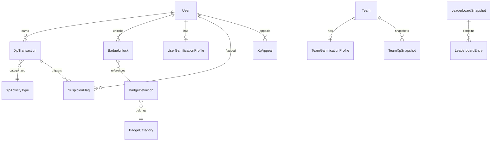

# GPMS Gamification Feature — Planning Document (Part 3/3)

> Continued from Part 2

---

## 8. Recommended Architecture

### 8.1 Database Entity Relationship Diagram



### 8.2 Core Prisma Models

```prisma
// ─── Gamification Profile ───────────────────────────────────

model UserGamificationProfile {
  id              String   @id @default(cuid())
  userId          String   @unique
  totalXp         Int      @default(0)
  weeklyXp        Int      @default(0)
  monthlyXp       Int      @default(0)
  level           Int      @default(1)
  currentStreak   Int      @default(0)
  longestStreak   Int      @default(0)
  lastActiveDate  DateTime?
  coins           Int      @default(0)
  tier            String   @default("BRONZE") // BRONZE|SILVER|GOLD|PLATINUM|DIAMOND
  suspicionScore  Int      @default(0)
  isFrozen        Boolean  @default(false)
  frozenUntil     DateTime?
  createdAt       DateTime @default(now())
  updatedAt       DateTime @updatedAt

  user            User     @relation(fields: [userId], references: [id], onDelete: Cascade)

  @@index([totalXp])
  @@index([weeklyXp])
  @@index([tier])
}

model TeamGamificationProfile {
  id              String   @id @default(cuid())
  teamId          String   @unique
  totalXp         Int      @default(0)
  weeklyXp        Int      @default(0)
  monthlyXp       Int      @default(0)
  tier            String   @default("BRONZE")
  contributionVariance Float @default(0) // 0=equal, 1=one person did everything
  xpMultiplier    Float    @default(1.0)
  hasImbalanceWarning Boolean @default(false)
  createdAt       DateTime @default(now())
  updatedAt       DateTime @updatedAt

  team            Team     @relation(fields: [teamId], references: [id], onDelete: Cascade)

  @@index([totalXp])
  @@index([weeklyXp])
}

// ─── XP Transactions ────────────────────────────────────────

enum XpSource {
  TASK_COMPLETE
  TASK_REVIEW
  SUBMISSION_APPROVED
  SUBMISSION_GRADED
  GITHUB_COMMIT
  GITHUB_PR_MERGED
  GITHUB_PR_REVIEW
  GITHUB_ISSUE
  MEETING_ATTENDANCE
  DISCUSSION_POST
  WEEKLY_REPORT
  PHASE_MILESTONE
  DAILY_LOGIN
  QUEST_COMPLETE
  BADGE_UNLOCK
  CHALLENGE_WIN
  MANUAL_BONUS
  MANUAL_DEDUCTION
  PENALTY
  ROLLBACK
  STREAK_BONUS
  GRADE_BONUS
}

enum XpTransactionStatus {
  APPLIED
  PENDING_REVIEW
  REJECTED
  ROLLED_BACK
}

model XpTransaction {
  id              String              @id @default(cuid())
  userId          String
  teamId          String?
  amount          Int                 // positive=award, negative=deduction
  balanceBefore   Int
  balanceAfter    Int
  source          XpSource
  sourceId        String?             // FK to originating entity
  reason          String?
  performedBy     String?             // userId or "SYSTEM"
  status          XpTransactionStatus @default(APPLIED)
  metadata        Json?               // { commitSha, prNumber, taskId, etc. }
  multiplierApplied Float             @default(1.0)
  createdAt       DateTime            @default(now())

  user            User                @relation(fields: [userId], references: [id], onDelete: Cascade)

  @@index([userId, createdAt])
  @@index([userId, source])
  @@index([status])
  @@index([teamId, createdAt])
  @@index([sourceId])
}

// ─── Badges ─────────────────────────────────────────────────

enum BadgeRarity {
  COMMON
  RARE
  EPIC
  LEGENDARY
}

model BadgeDefinition {
  id              String      @id @default(cuid())
  slug            String      @unique     // "task-master-100"
  name            String                  // "Task Master"
  description     String
  category        String                  // "productivity"|"development"|"collaboration"|etc
  rarity          BadgeRarity
  xpReward        Int                     // one-time XP on unlock
  iconName        String                  // lucide icon name
  isHidden        Boolean     @default(false)
  conditionType   String                  // "TASK_COUNT"|"STREAK"|"GITHUB_COMMITS"|etc
  conditionValue  Int                     // threshold value
  isActive        Boolean     @default(true)
  createdAt       DateTime    @default(now())

  unlocks         BadgeUnlock[]
}

model BadgeUnlock {
  id              String          @id @default(cuid())
  userId          String
  badgeId         String
  unlockedAt      DateTime        @default(now())

  user            User            @relation(fields: [userId], references: [id], onDelete: Cascade)
  badge           BadgeDefinition @relation(fields: [badgeId], references: [id], onDelete: Cascade)

  @@unique([userId, badgeId])
  @@index([userId])
}

// ─── Leaderboard ────────────────────────────────────────────

enum LeaderboardType {
  INDIVIDUAL_WEEKLY
  INDIVIDUAL_MONTHLY
  INDIVIDUAL_ALLTIME
  TEAM_WEEKLY
  TEAM_MONTHLY
  TEAM_ALLTIME
  GITHUB
  MOST_IMPROVED
}

model LeaderboardSnapshot {
  id              String          @id @default(cuid())
  type            LeaderboardType
  periodStart     DateTime
  periodEnd       DateTime
  generatedAt     DateTime        @default(now())
  entries         LeaderboardEntry[]

  @@index([type, periodStart])
  @@unique([type, periodStart])
}

model LeaderboardEntry {
  id              String              @id @default(cuid())
  snapshotId      String
  userId          String?
  teamId          String?
  rank            Int
  xp              Int
  previousRank    Int?
  rankChange      Int?                // positive=moved up, negative=moved down

  snapshot        LeaderboardSnapshot @relation(fields: [snapshotId], references: [id], onDelete: Cascade)

  @@index([snapshotId, rank])
}

// ─── Anti-Cheat ─────────────────────────────────────────────

enum FlagSeverity {
  LOW
  MEDIUM
  HIGH
  CRITICAL
}

enum FlagStatus {
  OPEN
  UNDER_REVIEW
  CLEARED
  CONFIRMED
  APPEALED
}

model SuspicionFlag {
  id              String        @id @default(cuid())
  userId          String
  transactionId   String?
  flagType        String        // "BURST_ACTIVITY"|"EMPTY_COMMIT"|"DUPLICATE"|etc
  severity        FlagSeverity
  status          FlagStatus    @default(OPEN)
  details         Json?
  scoreImpact     Int           // how much suspicion score increased
  reviewedBy      String?
  reviewedAt      DateTime?
  reviewNote      String?
  createdAt       DateTime      @default(now())

  user            User          @relation(fields: [userId], references: [id], onDelete: Cascade)

  @@index([userId, status])
  @@index([status, createdAt])
  @@index([severity, status])
}

model XpAppeal {
  id              String    @id @default(cuid())
  userId          String
  flagId          String?
  transactionId   String?
  reason          String
  evidence        String?
  status          String    @default("PENDING") // PENDING|APPROVED|DENIED|ESCALATED
  reviewedBy      String?
  reviewedAt      DateTime?
  reviewNote      String?
  createdAt       DateTime  @default(now())

  user            User      @relation(fields: [userId], references: [id], onDelete: Cascade)

  @@index([userId, status])
  @@index([status])
}

// ─── Admin XP Config ────────────────────────────────────────

model XpConfig {
  id              String    @id @default(cuid())
  key             String    @unique  // "TASK_BASE_XP"|"COMMIT_BASE_XP"|etc
  value           Int
  description     String?
  updatedBy       String?
  createdAt       DateTime  @default(now())
  updatedAt       DateTime  @updatedAt
}
```

### 8.3 Event-Driven XP Calculation Architecture

```
┌─────────────────┐     ┌──────────────────┐     ┌─────────────────┐
│  Action Source   │────▶│  Event Emitter   │────▶│  XP Processor   │
│  (Task, GitHub,  │     │  (EventBus)      │     │  (Background)   │
│   Submission...) │     └──────────────────┘     └────────┬────────┘
└─────────────────┘                                        │
                                                           ▼
                                              ┌────────────────────────┐
                                              │   Quality Gate Check   │
                                              │   (Anti-Cheat Rules)   │
                                              └────────────┬───────────┘
                                                           │
                                          ┌────────────────┼────────────────┐
                                          ▼                                 ▼
                                   ┌─────────────┐                  ┌──────────────┐
                                   │  Gates Pass  │                  │ Gates Fail   │
                                   │  → Apply XP  │                  │ → Hold XP    │
                                   │  → Check     │                  │ → Create     │
                                   │    Badges    │                  │   Flag       │
                                   │  → Update    │                  │ → Notify     │
                                   │    Profile   │                  │   reviewer   │
                                   └─────────────┘                  └──────────────┘
```

**Implementation: Use Node.js EventEmitter + Bull Queue**

```javascript
// Event flow example
eventBus.emit('task.completed', { taskId, userId, teamId, priority, completedAt });

// XP Processor listens
eventBus.on('task.completed', async (data) => {
  const baseXp = await getConfig('TASK_BASE_XP'); // e.g., 30
  const multiplier = PRIORITY_MULTIPLIERS[data.priority]; // e.g., 1.5
  const streakBonus = calculateStreakBonus(data.userId);
  
  const totalXp = Math.round(baseXp * multiplier * streakBonus);
  
  const antiCheatResult = await runQualityGates(data);
  
  if (antiCheatResult.passed) {
    await createXpTransaction(data.userId, totalXp, 'TASK_COMPLETE', data.taskId);
    await checkBadgeProgress(data.userId, 'TASK_COUNT');
    await updateTeamXp(data.teamId, totalXp * 0.5);
  } else {
    await holdXpForReview(data.userId, totalXp, 'TASK_COMPLETE', data.taskId, antiCheatResult);
  }
});
```

### 8.4 API Endpoints

#### Student-Facing APIs

| Method | Endpoint | Description |
|--------|----------|-------------|
| `GET` | `/api/gamification/profile` | Get current user's gamification profile |
| `GET` | `/api/gamification/xp-history` | Get XP transaction history (paginated) |
| `GET` | `/api/gamification/badges` | Get all badges with user's unlock status |
| `GET` | `/api/gamification/leaderboard?type=&period=` | Get leaderboard data |
| `GET` | `/api/gamification/quests` | Get active daily/weekly quests |
| `GET` | `/api/gamification/challenges` | Get active challenges |
| `GET` | `/api/gamification/stats` | Get user stats summary |
| `POST` | `/api/gamification/appeals` | Submit an anti-cheat appeal |

#### TA/Doctor APIs

| Method | Endpoint | Description |
|--------|----------|-------------|
| `POST` | `/api/gamification/xp/award` | Manually award XP |
| `POST` | `/api/gamification/xp/deduct` | Manually deduct XP (doctor only) |
| `GET` | `/api/gamification/review-queue` | Get pending XP reviews |
| `PUT` | `/api/gamification/review/:id` | Approve/reject pending XP |
| `GET` | `/api/gamification/flags?userId=` | View suspicion flags |
| `PUT` | `/api/gamification/flags/:id` | Clear/confirm a flag |

#### Admin APIs

| Method | Endpoint | Description |
|--------|----------|-------------|
| `GET` | `/api/gamification/admin/config` | Get all XP config values |
| `PUT` | `/api/gamification/admin/config` | Update XP config |
| `POST` | `/api/gamification/admin/rollback` | Rollback XP transactions |
| `GET` | `/api/gamification/admin/audit-log` | Full audit log |
| `POST` | `/api/gamification/admin/freeze/:userId` | Freeze user XP |
| `POST` | `/api/gamification/admin/reset-leaderboard` | Manual leaderboard reset |

### 8.5 Background Jobs (Bull Queue)

| Job | Schedule | Description |
|-----|----------|-------------|
| `streak-calculator` | Daily at 00:05 UTC | Check streaks, reset broken ones, award streak badges |
| `leaderboard-snapshot` | Weekly (Mon 00:10 UTC) + Monthly (1st 00:10 UTC) | Generate leaderboard snapshots |
| `weekly-xp-reset` | Weekly (Mon 00:00 UTC) | Reset `weeklyXp` counters on profiles |
| `monthly-xp-reset` | Monthly (1st 00:00 UTC) | Reset `monthlyXp` counters |
| `suspicion-decay` | Daily at 01:00 UTC | Reduce suspicion scores by 2 for clean users |
| `team-health-check` | Daily at 02:00 UTC | Calculate contribution variance, detect inactivity |
| `badge-evaluator` | On-demand (after XP events) | Check badge unlock conditions |
| `quest-expiry` | Daily at 00:00 UTC | Expire old quests, generate new daily quests |
| `xp-freeze-expiry` | Hourly | Unfreeze users whose freeze period ended |

### 8.6 Security & Permissions Model

```
Middleware chain for gamification APIs:

authenticate() → requireRole(['student','ta','doctor','admin']) → rateLimiter()
                                                                       │
                                              ┌────────────────────────┤
                                              ▼                        ▼
                                    Student routes              Staff routes
                                    (own data only)       (team-scoped for TA/doctor,
                                                           global for admin)
```

Key security rules:
- Students can only read their own profile, XP history, and submit appeals.
- TAs can award/review XP for their assigned teams only.
- Doctors can award/deduct XP for their supervised teams only.
- Only admins can modify XP config, rollback transactions, or freeze accounts.
- All write operations produce audit log entries.
- Rate limiting: 60 requests/min for read, 10 requests/min for write.

---

## 9. Best Practices & Final Recommendations

### 9.1 Recommended XP Strategy

| Aspect | Recommendation |
|--------|---------------|
| Base model | Fixed base XP per activity, dynamic multipliers for difficulty/quality |
| Decay | No decay; use time-windowed leaderboards instead |
| Late penalty | Graduated reduction (25%→50%→75%→0%) |
| GitHub | Included with quality gates; automatic with async review for failures |
| Daily cap | Soft cap at 500 XP/day to prevent burnout and farming |
| Transparency | Full XP history visible to the earning student |

### 9.2 Recommended Leaderboard Strategy

| Aspect | Recommendation |
|--------|---------------|
| Default view | Weekly individual |
| Multiple boards | Yes — weekly, monthly, all-time, team, most improved |
| Discouragement prevention | Tier system + anonymous bottom 30% + "most improved" board |
| Reset | Weekly + monthly; all-time persists |
| Filtering | By team, track, batch |

### 9.3 Recommended Badge Strategy

| Aspect | Recommendation |
|--------|---------------|
| Persistence | Permanent once earned |
| XP reward | One-time bonus on unlock |
| Visibility | Top 5 on profile card; full collection in profile |
| Hidden badges | Yes — for special/surprise achievements |
| Tiered badges | Yes — for progressive metrics (tasks, streaks, commits) |

### 9.4 Recommended Anti-Cheat Strategy

| Aspect | Recommendation |
|--------|---------------|
| Primary method | Automated quality gates on every XP-granting action |
| Secondary method | Suspicion scoring with automated escalation |
| Manual review | Required for flagged items; queue visible to TA/doctor/admin |
| Penalties | Graduated: warning → freeze → probation → reset |
| Appeals | Supported with 48h review SLA |
| Audit log | Immutable; covers all XP changes |

### 9.5 What to Automate vs. Manual Approval

| Automated | Manual Approval Required |
|-----------|------------------------|
| XP calculation for all standard activities | XP deductions |
| Badge unlock detection | Bulk XP awards |
| Streak tracking | Anti-cheat flag resolution |
| Leaderboard snapshot generation | Suspicion score override |
| GitHub quality gate checks | XP rollbacks |
| Daily/weekly quest generation | Cheating penalties beyond warnings |
| Inactivity detection | Appeal decisions |
| Suspicion score decay | Config changes |

### 9.6 What to Avoid

| Anti-Pattern | Why |
|-------------|-----|
| ❌ XP decay over time | Creates anxiety; punishes breaks |
| ❌ Negative XP balances | Demotivating; use 0 as floor |
| ❌ Showing exact rank for bottom performers | Discouraging; use tier system |
| ❌ Allowing XP for passive actions (viewing, reading) | Easily gamed |
| ❌ Complex formulas students can't understand | Kills trust; keep it transparent |
| ❌ Team punishment without warning period | Unfair; always warn first |
| ❌ Automated XP deductions without human review | Risk of false positives |
| ❌ Making gamification required for grading | XP should motivate, not replace grades |

### 9.7 MVP Scope (Phase 1)

Build these first to deliver value quickly:

| Component | MVP Features |
|-----------|-------------|
| **XP System** | Fixed XP for task completion, submissions, daily login. No GitHub yet. |
| **Profile** | Total XP, level, streak display. Basic stats card. |
| **Leaderboard** | Individual all-time only. Simple ranked list. |
| **Badges** | 10 core badges (getting started + task tiers + streak tiers). |
| **Transaction Log** | Basic XP history for students. |
| **Admin** | Manual XP award/deduct. View all users' XP. |
| **Anti-Cheat** | Basic rate limits + task minimum age check. No suspicion scoring yet. |

**Estimated effort:** 2–3 weeks for backend + 1–2 weeks for frontend.

### 9.8 Phase 2 Improvements

| Component | Phase 2 Features |
|-----------|-----------------|
| **GitHub XP** | Quality gates, commit/PR/review XP |
| **Team XP** | Team profiles, contribution variance, team leaderboard |
| **Quests** | Daily/weekly auto-generated quests |
| **Advanced badges** | GitHub badges, teamwork badges, hidden badges |
| **Leaderboard** | Weekly/monthly reset, tier system, most improved, filters |
| **Anti-Cheat** | Suspicion scoring, review queue, automated flagging |
| **Admin dashboard** | XP config editor, audit log viewer, flag management |

### 9.9 Phase 3 (Future)

| Component | Future Features |
|-----------|----------------|
| **Challenges** | Time-limited competitions (individual + team) |
| **Reward Store** | Spend coins on themes, avatar frames, perks |
| **Quality Score** | Grade-weighted XP bonuses |
| **Notifications** | Real-time badge unlock celebrations, "almost there" nudges |
| **Analytics** | XP trends, team health dashboards, engagement reports |
| **Appeal System** | Full student appeal workflow |
| **Streak Shield** | Purchasable streak protection |

---

## Summary

This gamification system transforms GPMS from a project management tool into an **engagement platform** that motivates consistent, high-quality student work while maintaining fairness through anti-cheat protections and administrative oversight.

The architecture is designed to be:
- **Scalable** — event-driven processing, background jobs, snapshot-based leaderboards
- **Fair** — transparent fixed XP, quality gates, graduated penalties with appeals
- **Maintainable** — admin-configurable weights, clear audit trails, modular design
- **Motivating** — multiple leaderboards, tiered badges, streak bonuses, personal progress emphasis

> [!TIP]
> Start with the MVP (Phase 1) to validate the core loop: **do work → earn XP → see progress → compete → do more work**. Layer on complexity in Phase 2 and 3 based on student feedback and engagement metrics.
