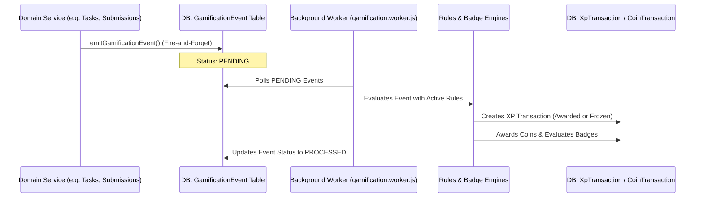

# Complete Analysis of the Gamification System in GPMS

The Graduation Project Management System (GPMS) includes a comprehensive gamification module designed to drive student engagement, reward collaborative behaviors, and track academic milestones. It is split into two co-operating systems: **The XP and Leveling Economy** and **The Coin and Quest Economy**. 

This document details the functional mechanics, architecture, mathematical equations, safety features, and database schemas governing the gamification system.

---

## 1. System Architecture & Flow

To avoid blocking or failing critical academic operations (such as submitting deliverables or approving tasks), the gamification engine uses a decoupled **Outbox Pattern**.

1. **Event Emission**: When an activity occurs (e.g., a task is approved), the respective domain service calls `emitGamificationEvent` in [gamification.emitter.js](file:///e:/FCAI%20-%20Fourth%20Level/Graduation%20Project/GPMS/GraduationProjectBackend/src/modules/gamification/gamification.emitter.js). The event is written to the database with a status of `PENDING`.
2. **Asynchronous Processing**: A background worker polls the `GamificationEvent` outbox in [gamification.processor.js](file:///e:/FCAI%20-%20Fourth%20Level/Graduation%20Project/GPMS/GraduationProjectBackend/src/modules/gamification/gamification.processor.js) and routes events through the **Rules Engine** and **Badge Engine**.
3. **Ledger Integrity**: Transactions are recorded in an append-only, double-entry ledger (`XpTransaction` and `CoinTransaction`) to ensure total auditability.

---

## 2. XP & Leveling Economy

The XP economy defines how individuals and teams accumulate Experience Points (XP) and level up.

### 2.1 The Rules Engine
The core of XP distribution is [gamification.rules-engine.js](file:///e:/FCAI%20-%20Fourth%20Level/Graduation%20Project/GPMS/GraduationProjectBackend/src/modules/gamification/gamification.rules-engine.js). The final XP awarded is calculated dynamically using a product of multipliers applied to a base XP value:

$$\text{Final XP} = \text{baseXp} \times \text{Effort Multiplier} \times \text{Difficulty Multiplier} \times \text{Timeliness Multiplier} \times \text{Evidence Multiplier} \times \text{Quality Multiplier}$$

*   **Base XP**: Configured per rule in the `GamificationRule` table.
*   **Effort Multiplier**: Tied directly to the task's story points or actual points:
    $$\text{Effort Multiplier} = \min\left(2.0, \max\left(0.35, \frac{\text{Story Points}}{3}\right)\right)$$
    *   *Examples*: 1 Pt = $0.35\times$ multiplier; 3 Pts = $1.0\times$ multiplier; $\ge 6$ Pts = $2.0\times$ multiplier.
*   **Difficulty Multiplier**: Maps task priority: `LOW (0.8)`, `MEDIUM (1.0)`, `HIGH (1.25)`, `CRITICAL (1.5)`.
*   **Timeliness Multiplier**: Rewards on-time completion: `onTime (1.0)`, `<24h late (0.8)`, `<3d late (0.6)`, `<7d late (0.4)`, `>7d late (0)`.
*   **Evidence Multiplier**: Scales according to task verifiability: `repoBackedWithPR (1.15)`, `repoBackedNoPR (1.0)`, `manual (0.5)`.
*   **Quality Multiplier**: Grade-based (used for submissions): `90-100 (1.2/1.25)`, `80-89 (1.0)`, `70-79 (0.7/0.8)`, `60-69 (0.4/0.5)`, `<60 (0)`.

### 2.2 Level Calculation Formula
A student's level is derived from their cumulative lifetime XP using the formula in [gamification.math.js](file:///e:/FCAI%20-%20Fourth%20Level/Graduation%20Project/GPMS/GraduationProjectBackend/src/modules/gamification/gamification.math.js):

$$\text{Level} = \left\lfloor\sqrt{\frac{\text{Lifetime XP}}{100}}\right\rfloor + 1$$

To achieve subsequent levels, the lifetime XP requirements scale exponentially:
*   **Level 1**: 0 XP
*   **Level 2**: 100 XP
*   **Level 3**: 400 XP
*   **Level 4**: 900 XP
*   **Level 5**: 1,600 XP
*   **Level 6**: 2,500 XP
*   *(General threshold)*: $\text{Required XP} = 100 \times (\text{Level} - 1)^2$

### 2.3 Rule Caps (Inflation Control)
To prevent students from farming XP or inflating stats, active rules enforce limits defined in the `caps` field (e.g., `maxXpPerUserPerWeek: 900`, `maxPerUserPerDay: 3`, or `maxPerTask: 1`). If a cap is breached, the transaction is skipped.

---

## 3. Anti-Cheat & Fraud Detection

To maintain academic integrity, the processor runs fraud detection heuristics on incoming events before completing any XP award:

1. **Duplicate Submission Detection**: When a deliverable is submitted, the system generates hashes (`fileHash`, `normalizedTextHash`, `contentFingerprint`). If a match is found with an already approved submission:
    *   The transaction status is set to `FROZEN`.
    *   A [SuspiciousActivityCase](file:///e:/FCAI%20-%20Fourth%20Level/Graduation%20Project/GPMS/GraduationProjectBackend/prisma/schema.prisma#L2133) is created with a score of `85` and reason `"Duplicate submission content detected"`.
    *   Staff (Doctor/Admin) are notified to review the case.
2. **Rapid Task Approval Detection**: If a task moves through stages too quickly:
    *   *Creation to Approval*: $< 10$ minutes $\rightarrow$ Case score `65`.
    *   *Acceptance to Review Submission*: $< 5$ minutes $\rightarrow$ Case score `45`.
    *   XP is set to `FROZEN` and flagged as `"Task was approved unusually quickly"`.
3. **Self-Approval Bypass**: If `assigneeUserId === actorUserId` (a student trying to approve their own task), the rule engine discards the event completely.
4. **Staff Review Workflow**: Doctors and admins access the review dashboard to review frozen transactions. They can `APPROVE` (unfreeze and credit XP) or `REJECT` (void the XP) the transactions.

---

## 4. Reversals
If a task is reopened by a leader or supervisor after having been marked as approved:
*   A `TASK_REOPENED` event is triggered.
*   The system queries all prior `TASK_APPROVED` transaction credits associated with that task.
*   A matching **DEBIT** transaction is logged, and the user's and team's active XP balances are deducted accordingly.

---

## 5. Coin Economy, Quests & Reward Shop

GPMS implements a secondary coin-based currency system, separate from XP, managed by [economy.service.js](file:///e:/FCAI%20-%20Fourth%20Level/Graduation%20Project/GPMS/GraduationProjectBackend/src/modules/economy/economy.service.js).

### 5.1 Earning Coins
*   **XP Award Conversion**: For every validated XP transaction successfully credited to a user, they receive a coin payout of:
    $$\text{Coins Earned} = \max\left(1, \left\lfloor\frac{\text{Awarded XP}}{10}\right\rfloor\right)$$
*   **Quests**: Completing Daily, Weekly, or Milestone Quests awards large coin payouts.

### 5.2 Quests (Challenges)
Quests track specific student metrics over rolling windows (e.g. daily, weekly, or lifetime). Quests metrics include:
*   `XP_EARNED`
*   `TASKS_DONE`
*   `SUBMISSIONS_APPROVED`
*   `PRS_MERGED` (integrated with GitHub webhooks)
*   `REVIEWS_GIVEN` (PR reviews submitted on GitHub)
*   `SPRINTS_COMPLETED`
*   `WEEKLY_REPORTS_APPROVED`

Once a quest's target value is reached, it becomes *claimable*. Students manually trigger `claimQuestRewardTransaction` in the shop to obtain their coin reward.

### 5.3 Cosmetic Reward Shop
Coins can be exchanged in the Reward Store for visual profile customizations:
*   **Avatar Frames** (equipped around user avatars)
*   **Profile Themes**
*   **Custom Titles** (displayed alongside the student's name, e.g. "Task Master")
*   **Badge Skins** (special styling for unlocked achievements)

The system checks for sufficient coin balances and inventory limits before confirming a purchase.

---

## 6. Achievements & Badges

Achievements represent long-term milestone goals defined in `BadgeDefinition`.

*   **Types**: Divided into `USER` badges (e.g. "First Steps", "Task Champion", "Code Reviewer") and `TEAM` badges (e.g., "Building It" for reaching the Implementation stage).
*   **Unlocks**: When an XP transaction completes, the engine checks criteria eligibility (e.g., `criteria.count = 10` for tasks completed, or `criteria.gradeEquals = 100` for a perfect score).
*   **Rewards**: Unlocking a badge awards a one-time bonus XP reward to the user/team, logged under rule code `BADGE_REWARD`.

---

## 7. Leaderboards & Snapshots

Leaderboards are structured into snapshots generated periodically to prevent database query performance degradation.

*   **Scopes**: `GLOBAL`, `SUPERVISOR`, `TEAM`, `TRACK`, and `DEPARTMENT`.
*   **Types**: Individual Weekly, Semester, and Lifetime; Team Weekly and Semester.
*   **Intervals**:
    *   *Weekly*: Tracks XP between Monday 00:00:00 UTC and Sunday 23:59:59 UTC.
    *   *Semester*: Jan-Jun (months 0-5) and Jul-Dec (months 6-11).
    *   *Lifetime*: 1970 to 9999.
*   **Snapshot Storage**: To load leaderboard rankings instantly in the frontend, the backend caches ranks in the `LeaderboardSnapshot` table via scheduled recalculations (run by `recalculate-gamification.js`).

---

## 8. Frontend Interface Integration

The frontend displays these elements to students and staff:

1.  **Dashboard Tab ([GamificationTab](file:///e:/FCAI%20-%20Fourth%20Level/Graduation%20Project/GPMS/GraduationProjectFrontend/components/dashboard/gamification-tab.tsx))**: Shows live XP progress, current level, lifetime/weekly XP, recent badges, and the top 5 students in the weekly leaderboard.
2.  **Gamification Hub ([GamificationPage](file:///e:/FCAI%20-%20Fourth%20Level/Graduation%20Project/GPMS/GraduationProjectFrontend/app/dashboard/gamification/page.tsx))**:
    *   *Hero Panel*: Displays player status, level, current cosmetics (frames/titles), and coin wallet.
    *   *Challenges Section*: Tabs to track/claim Daily, Weekly, and Milestone quests.
    *   *Shop Section*: Grid of cosmetic rewards with buy/equip toggle functionality.
    *   *Achievements Tab*: Grid of earned and locked achievements, filtering by rarity (`COMMON`, `RARE`, `EPIC`, `LEGENDARY`).
    *   *Activity Log*: Full ledger of recent transactions and coin usage.
3.  **Review Dashboard ([Admin page](file:///e:/FCAI%20-%20Fourth%20Level/Graduation%20Project/GPMS/GraduationProjectFrontend/app/dashboard/gamification/admin/page.tsx))**: Used by supervisors to approve frozen suspicious activities or submit manual XP adjustment requests.
